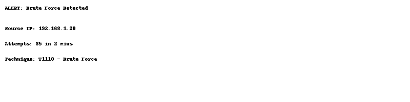
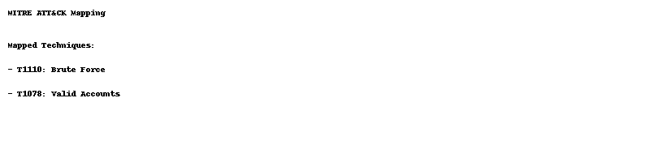
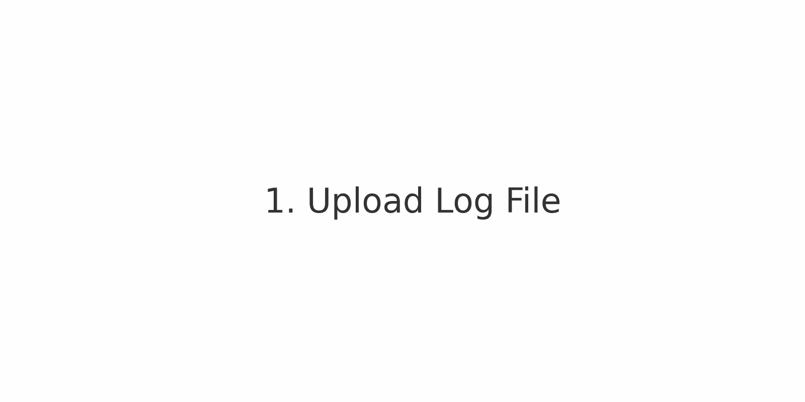

# LogSleuth

**LogSleuth** is a hands-on cybersecurity analyst project that simulates the core functions of a SOC — log parsing, detection, enrichment, MITRE mapping, and reporting.

---

## 🔍 Detection Output



## 🎯 MITRE ATT&CK Mapping



---

## 📂 Project Structure

```
logsleuth/
├── logs/sample_logs/
├── rules/
├── parser/
├── engine/
├── threat_intel/
├── mitre/
├── report/
├── dashboard/
├── docs/
└── README.md
```

## 🚀 How to Use

1. Add raw log files to `logs/sample_logs/`
2. Write detection rules in `rules/detection_rules.yml`
3. Run the parser, engine, and report generator scripts
4. View mapped alerts and MITRE techniques
5. Generate an incident report from `report/`

---

## 💡 Ideal For

- Security Analyst trainees
- Blue team interview prep
- Resume/portfolio project

## 📘 License

MIT


---

## 🧪 Demo Walkthrough

This short animation demonstrates how LogSleuth detects suspicious events, maps to MITRE ATT&CK techniques, and summarizes findings.


